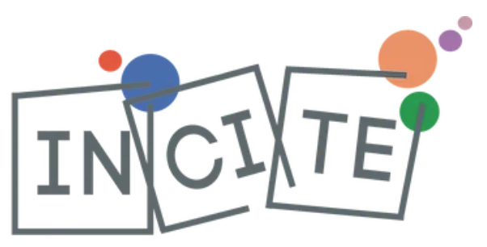

```{=html}
<script>document.body.dataset.pqSecao = "atividades";</script>
```

::: {.grid}
::: {.g-col-12 .g-col-md-8}

Este site apresenta os resultados de um *survey* com bolsistas de
Produtividade em Pesquisa (PQ) do CNPq sobre suas percepções e atividades de
divulgação científica.

**<span data-pq-num="meta.n_total"></span> respostas**, coletadas entre
janeiro e março de 2023 — cerca de 12% da população de bolsistas PQ na época.
São <span data-pq-num="meta.n_cruzamentos"></span> cruzamentos
pré-calculados, distribuídos por cinco seções.

Se você quer a leitura em vez dos dados,
comece pelo **[resumo dos resultados](achados.qmd)**.

:::
::: {.g-col-12 .g-col-md-4}
{fig-alt="Ilustração da pedra de Roseta" width="100%"}
:::
:::

::: {.panel-tabset}

## Sobre a pesquisa

Esta pesquisa foi realizada com o objetivo de compreender as percepções e
opiniões dos cientistas brasileiros em relação à divulgação científica.
Especificamente, convidamos para participar os bolsistas de produtividade em
pesquisa (PQ) do Conselho Nacional de Desenvolvimento Científico e Tecnológico
(CNPq), uma população conhecida por sua alta atividade na produção científica.

A coleta de informações foi feita a partir de um questionário *online*
autoaplicado, que continha 51 perguntas organizadas em sete seções, abordando
desde temas de interesse e hábitos culturais até atividades de divulgação
científica e opiniões sobre ciência e tecnologia na sociedade.

A coleta foi realizada entre janeiro e março de 2023. No total, foram
coletadas <span data-pq-num="meta.n_total"></span> respostas, o que significa
cerca de 12% da população de bolsistas PQ na época. A amostragem foi feita de
forma estratificada, garantindo que a distribuição dos respondentes fosse
proporcional à distribuição dos bolsistas PQ por área de conhecimento, sexo,
região geográfica e categoria da bolsa PQ.

Os detalhes de ponderação, correção para testes múltiplos e limites de
interpretação estão na [nota metodológica](metodologia.qmd).

### Para saber mais

Pereira, M., Castelfranchi, Y., & Massarani, L. (2024). Científicos brasileños
y divulgación científica: Una propuesta de clasificación. **Revista
Iberoamericana de Ciencia, Tecnología y Sociedad — CTS**.
<https://ojs.revistacts.net/index.php/CTS/article/view/779>

Pereira, M. **Ciência, sociedade, divulgação científica: a visão dos
cientistas**. 2023. 167 p. Dissertação de Mestrado em Sociologia —
Universidade Federal de Minas Gerais, Belo Horizonte, 2023.
<http://hdl.handle.net/1843/55328>

## Questionário

Os dados apresentados aqui são de perguntas selecionadas de cinco das sete
seções do questionário original.

[Baixar o questionário completo (PDF)](questionario.pdf){.btn .btn-outline-secondary .btn-sm}

### As cinco seções

| Seção | O que traz |
|---|---|
| [Resultados](achados.qmd) | Resumo descritivo, e onde encontrar a interpretação revisada |
| [Atividades de divulgação](atividades.qmd) | O que os cientistas fizeram nos 12 meses anteriores, e a relação deles com a mídia |
| [Opiniões sobre C&T](opinioes-ct.qmd) | A ciência brasileira, riscos e benefícios, temas de preocupação, gestão da política |
| [Opiniões sobre divulgação](opinioes-dc.qmd) | Modelos de comunicação, importância atribuída, públicos prioritários |
| [Motivações e obstáculos](motivacoes.qmd) | O que empurra, o que trava, e a formação em divulgação |
| [Perfil sociodemográfico](perfil.qmd) | Quem respondeu, e como as características se cruzam |

## O gráfico de mosaico

Quase todo cruzamento deste site é apresentado como um **gráfico de mosaico**
colorido por resíduos de Pearson. Vale entender como se lê.



## Contato

📧 [mapereira@ufmg.br](mailto:mapereira@ufmg.br)

Página do pesquisador: <https://marcelo-pereira-pcst.github.io/>

Perfil no [ResearchGate](https://www.researchgate.net/profile/Marcelo-Pereira-44)

Código do site e do processamento:
<https://github.com/marcelo-pereira-pcst/dashboardpq>

:::

::: {.grid style="align-items:center; margin-top:2rem;"}
::: {.g-col-6 .g-col-md-3}
{fig-alt="Logotipo do Incite" width="100%"}
:::
::: {.g-col-6 .g-col-md-3}
{fig-alt="Logotipo do INCT-CPCT" width="100%"}
:::
:::
